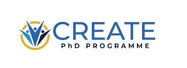

This site is home to brief summaries of clinical infection papers I found interesting and an [OpenAlex](https://openalex.org/) powered feed of high impact infection papers.

::: {.grid}

::: {.g-col-12 .g-col-md-6}
### Latest posts

The [Blog](blog.qmd) has spotlights on individual, recent papers that I think are clinically important.

Please do [get in touch](about.qmd) with suggestions for papers to review, or (even better) if you want to write the review. The [README](https://github.com/jackwgoodall/infection_updates/blob/bea938c8d2bb57bd3e73f7e6a2026a687197d232/README.md) on the main github has a guide to writing a blog post. 
:::

::: {.g-col-12 .g-col-md-6}
### What's publishing now

The [Latest Papers](papers.qmd) page pulls recent publications in real time from OpenAlex.  It shows all recent publications across infectious disease, microbiology, virology, parasitology and epidemiology from selected high-impact journals. 

Please do [get in touch](about.qmd) if you have journals you think should be included or have ways you think this feed could be improved.
:::

::: 
### Useful Resources 

The [Useful Resources](resources.qmd) has a highly subjective collection of resources I think are useful. 
Again, please do [get in touch](about.qmd) if you have suggestions on additions to this, or feel free to [add them yourself](https://github.com/jackwgoodall/infection_updates/blob/bea938c8d2bb57bd3e73f7e6a2026a687197d232/README.md).

  
*I am very grateful to the Wellcome Trust and the London School of Hygiene and Tropical Medicine's [CREATE PhD Programme](https://www.create-phd.org/), who give me the time and brain space to do things like this. However, they have not had provided any input or editorial oversight of the website's contents. That's on me.*

::: {style="text-align: center; margin-top: 1.5rem;"}
{width=150 style="margin: 0 1rem;"}
{width=120 style="margin: 0 1rem;"}
{width=150 style="margin: 0 1rem;"}
:::