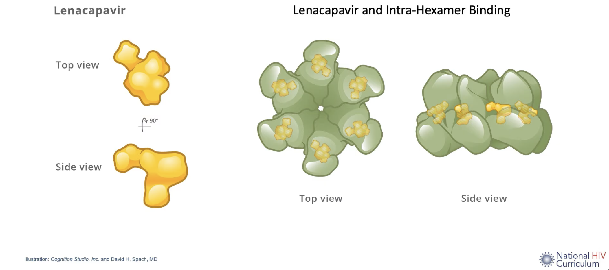

### TLDR;

Médecins Sans Frontières (MSF) have written a [no-holds-barred letter to Gilead](https://www.doctorswithoutborders.org/latest/prevention-should-not-be-privilege-msf-calls-gilead-direct-access-lenacapavir) imploring the pharmaceutical giant to *sell* them lenacapavir, the [highly effective](https://www.nejm.org/doi/10.1056/NEJMoa2407001) HIV pre-exposure prophylaxis (PrEP). So far, it seems, Gilead are not in the mood to talk.

### Lenacapavir

The HIV capsid is a cone-shaped protein container inside the HIV virion, which protects the HIV genome and key enzymes. It is made up of multiple short protein monomers, which [tessellate](https://www.youtube.com/watch?v=MPH89HIBLiw&list=RDMPH89HIBLiw) together rather elegantly as pentamers and hexamers to form this flexible container.

Lenacapavir blocks HIV viral replication by interfering with the functioning of this capsid. Normally the monomers are bound quite loosely in their hexamers, which allows the host cell's nucleotides to flow though capsid shell, which the virus then uses to turn its RNA into DNA, ready for host integration. Lenacapavir binds to each of the monomers, increasing the overall rigidity of the hexamers they make up. The end result is that lenacapavir disrupts viral replication at multiple different stages of its life cycle, including importation into the nucleus, capsid un-coating, and the production of new viral particles.

[{fig-align="left" width="600"}](https://www.youtube.com/watch?v=iZ9KDxV5Zbs)

It's a subcutaneous inject, taken every six months, and it's this long half-life, combined with negligible resistance rates that makes it such an appealing prospect.

The use case that has emerged is as a HIV pre-exposure prophylactic and the evidence so far seems that it is highly effective in this role. Part of this seems to be that it removes the burden of taking a daily tablet, which can be both easier to conceal in places where HIV treatment remains stigmatised.

### The trials

Gilead has undertaken a bunch of large, well conducted RCTs on lenacapavir in a number of different settings. Gilead have called these the [PURPOSE trials](https://www.purposestudies.com/), and so far two have published results, and there are a further *four* phase II/III trials at various stages.

PURPOSE 1 recruited Cisgender women and adolescents in Uganda and South Africa, whilst PURPOSE 2 enrolled Cisgender Men, Transgender Women, Transgender Men, and Gender Non-Binary individuals Who Have Sex With Partners Assigned Male at Birth. The ongoing trials look at Cisgender adult women in the US (PURPOSE 3), people who inject drugs (PURPOSE 4), people at high risk of HIV acquisition, but not currently taking PrEP (PURPOSE 5) and whether the dose can be dropped to once yearly (PURPOSE 365).

The science that these trials stands on [goes back a long way](https://www.science.org/doi/10.1126/science.283.5398.80) and, as is almost invariably the case, is the work of large numbers of people, working on different angles, and mostly receiving large amounts of public funding.

### MSF's argument

MSF have written an [open letter](https://www.doctorswithoutborders.org/latest/prevention-should-not-be-privilege-msf-calls-gilead-direct-access-lenacapavir) to Gilead, asking that they they agree to sell MSF doses of lenacapavir, above and beyond what Gilead have already provided to the Global Fund. The Global Fund stock is capped at two million doses, which they argue is well below the global need. The proposed market price for lenacapavir is reported as \$28,000 in high income markets.

The argument put forward by MSF is (to my mind at least) simple and effective:

1.  The development of this drug stands on the shoulders of many people
2.  Many people (including those from sub-Saharan Africa) volunteered to support the research by taking an experimental drug
3.  The profits from direct purchases in LMICs is likely to be negligible

The counter argument goes:

1.  We hold the patent, so we will charge whatever we like, and sell to whomever we like.

MSF is not asking Gilead to give them the drug for free, nor are they suggesting that they provide this at cost price to the whole world. Lenacapavir is a great drug, and the focus on proving efficacy in under-served communities in the PURPOSE trials by Gilead is highly commendable. It would just be great if they could make it all the way over the line and agree to sell it to MSF so they can use it in the communities who will benefit the most.
