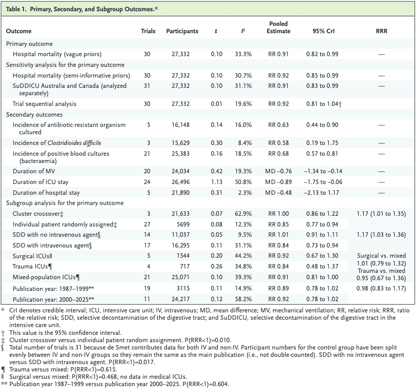

[*Selective Decontamination of the Digestive Tract in Adult Mechanically Ventilated Patients — An Updated Systematic Review with Bayesian Meta-Analysis*](https://doi.org/10.1056/EVIDoa2500264)*, Hammond et al., NEJM Evidence, April 2026*

### TLDR;

A large meta-analysis supports the use of selective decontamination of the digestive tract, using targeted antibiotics. This seems to work only when intravenous antibiotics are given alongside oral ones. There is no substantive evidence that this practice worsenings multi-drug resistance.

### Background

Selective Decontamination of the Digestive Tract (SDD) is idea that we might reduce the incidence of infectious complications with antibiotics has a nearly forty-year pedigree. Mechanically ventilated patients have been a particular focus, as they have a significantly elevated risk of both aspiration and gut translocation. The core hypothesis is that by reducing the bioburden of pathogenic bacteria in the upper respiratory and gastrointestinal tract, some of this risk can be mitigated.

The 'selective' bit refers to the aspiration that these regimens only target the organisms that typically cause problems (Gram-negatives, *Staph. aureus*, and yeasts) while leaving the anaerobic flora as undisturbed as possible. Antibiotics are typically applied directly to the oropharynx as a paste and delivered to the upper GI tract via an NG tube. Some centers and protocols also add a short course of intravenous therapy. The most recent and largest trial ([SuDDICU](https://www.nejm.org/doi/full/10.1056/NEJMoa2506398?query=featured_home)) achieves this with oral and enteral tobramycin, nystatin, and colistin for the duration of intubation, alongside intravenous ceftriaxone for four days.

The points of controversy are clear. There are strong incentives not to use unnecessary antibiotics: patients experience toxicities and develop resistance. That resistance spills into the clinical environment and ultimately into the community. An ICU with an MDR problem is an ICU with a big problem. Some very serious people are [very seriously worried](https://business.itn.co.uk/professor-dame-sally-davies-if-we-dont-contain-amr-we-lose-modern-medicine/) that the rise of AMR could jeopardise much of the progress modern medicine has made. Alongside this, mounting evidence suggests that [shorter courses of antibiotics are better in almost all scenarios](https://www.bradspellberg.com/shorter-is-better), let alone when there is no established infection. Additionally, recent evidence has shown that antibiotics can [perturb an individual's microbiome for as long as eight years](https://www.nature.com/articles/s41591-026-04284-y), which, combined with growing evidence linking gut microbiome dysbiosis to a suite of adverse health outcomes, means we really need to justify any intervention likely to cause microbiome perturbations as significant as those proposed here.

There have been a number of studies looking at SDD dating back to the 1980s. Interestingly, the first trials were in haematology patients, with the principal aim of reducing bloodstream infections. The practice remains equally controversial in haematology, where a parallel debate is ongoing. In mechanical ventilation, inconsistent results and variable trial design quality have limited uptake. It is standard practice in the Netherlands; however, most other countries have not adopted it.

#### The SuDDICU Consortium

The SuDDICU consortium was established in 2009 to try to resolve the ambiguity. It is a collaboration between sites in Canada, Australia, and the UK. The [Australian sites reported their findings in 2022](https://doi.org/10.1001/jama.2022.19709), published alongside an affiliated meta-analysis. That analysis showed a 99.3% posterior probability that SDD reduced hospital mortality compared to standard care, with a summary risk ratio of 0.91.

The meta-analysis was updated following the publication of the [Canadian component](https://www.nejm.org/doi/10.1056/NEJMoa2506398) of the study. As far as I can tell, the UK arm of this trial never ran. This review focuses on that new meta-analysis rather than the SuDDICU trial itself; however, it should be noted that this trial alone contributed a third of the meta-analysis' total patients.

### Study Design

The updated search spanned MEDLINE, EMBASE, and CENTRAL from September 2022 to August 2025, identifying one new trial (the full SuDDICU trial) since the previous analysis. This gave a total of 32 RCTs with 27,687 participants. Inclusion criteria were well-defined: RCTs of critically ill adults in whom at least 75% were invasively ventilated, comparing topical antimicrobial SDD (with or without systemic antibiotics) against standard care or placebo.

A notable methodological strength is the use of a Bayesian random-effects framework, which is well-suited to this evidence base. Unlike frequentist methods, the Bayesian approach allows direct probability statements about treatment effects. It spares us from being forced into foolish conclusions simply because of the capricious nature of a p-value. There are choices to be made about priors, and although that is a discussion for another day, their approach of reporting both vague and semi-informative priors (centred on no effect) seems sensible.

Cluster randomised trials were appropriately adjusted for using the effective sample size approach, accounting for intracluster correlation. Heterogeneity was assessed using tau, *I²*, and prediction intervals, providing a thorough picture of between-study variability. Evidence certainty was graded using GRADE.

A limitation worth flagging is the reliance on aggregate-level rather than individual patient data, which constrains the depth of subgroup analyses.

### Results

The primary analysis included 30 trials (27,332 participants), yielding a pooled relative risk (RR) for hospital mortality of 0.91 (95% credible interval 0.82–0.99), with a **99.2% posterior probability that SDD reduces mortality compared to standard care**. Heterogeneity was modest (*I²*=33.3%, tau=0.10), though the prediction interval of 0.69–1.15 indicates meaningful uncertainty about the effect in any individual future trial setting.

{width="301"}

Subgroup analyses revealed an important signal: mortality benefit appeared confined to regimens incorporating an intravenous antibiotic component (RR 0.84, 95% CrI 0.73–0.94) and to individually randomised rather than cluster-randomised trials (RR 0.85 vs 1.00 respectively). This latter finding is concerning, as the largest and most contemporary trials (including SuDDICU) used cluster designs, and the cluster subgroup showed no mortality benefit. This warrants caution in interpretation.

Secondary outcomes supported a broadly favourable profile for SDD, including reductions in bacteraemia (RR 0.68), multidrug-resistant organism (MRO) isolation (RR 0.63), and duration of mechanical ventilation (mean difference −0.76 days), though GRADE certainty ratings for these ranged from low to very low, principally due to indirectness, risk of bias, and inconsistency.

The reduced rate of MROs in the intervention group is intriguing. They note that the total antibiotic use was very similar between the two groups. Presumably, the control group required more antibiotics to treat their bloodstream infections (and likely ventilator-associated pneumonias – this outcome was not included in the analysis due to the well-known challenges in accurately diagnosing this condition). These treatment antibiotics are often broader-spectrum and given for longer than the SDD regimen, which may explain this apparently paradoxical result. Although MROs in individual patients are an imperfect proxy for the ICU environment more broadly, this finding is generally reassuring. The SuDDICU trial also recruited non-randomised patients in the same ICUs, and while non-inferiority was not formally met, these adjacent patients did have a numerically lower rate of first MRO isolation.

### Conclusion

I instinctively don't like this. I am convinced that the microbiome matters, and years of practising antimicrobial stewardship make this intervention feel counterintuitive. However, this is precisely what RCTs and meta-analyses are for: providing better ways to look after patients than our instincts alone can offer.

There is a lot to like about how this was done. Updating the Bayesian analysis (even after the first was already fairly conclusive) seems like good science, and very much in the spirit of Bayesian updating. I hope this approach becomes the norm for major trials. I also appreciate their GRADE summaries, which pair the numbers with a plain language interpretation.

If this were to be rolled out, it would clearly require substantial post hoc monitoring, particularly of local resistance rates, alongside long-term patient follow-up. That said, very few interventions show a mortality risk ratio of 0.9. You either have to argue that the number is wrong, or figure out how to safely implement it.

Finally, the typeface and formatting of NEJM Evidence alone is reason enough to read this paper (looking at you, JAMA).
