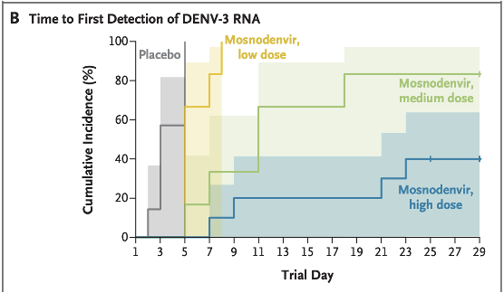
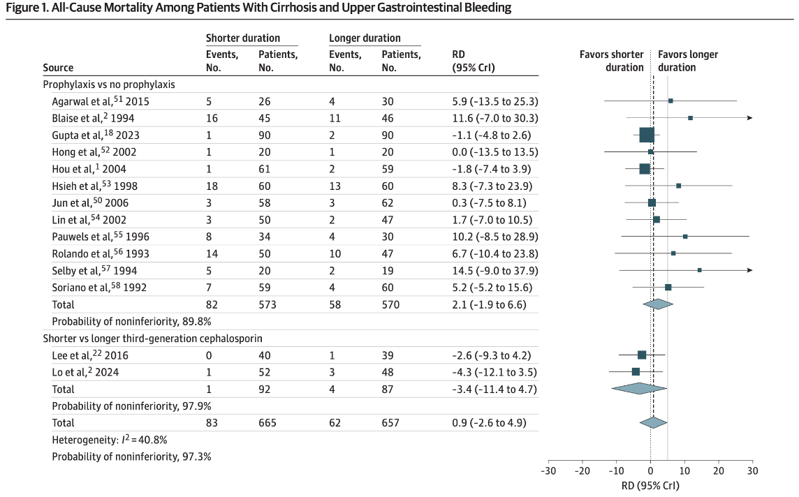
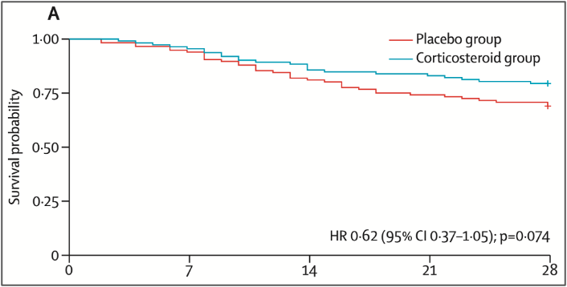
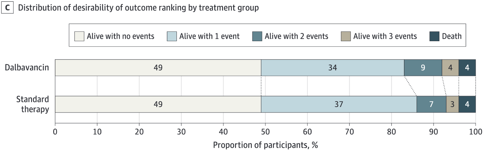
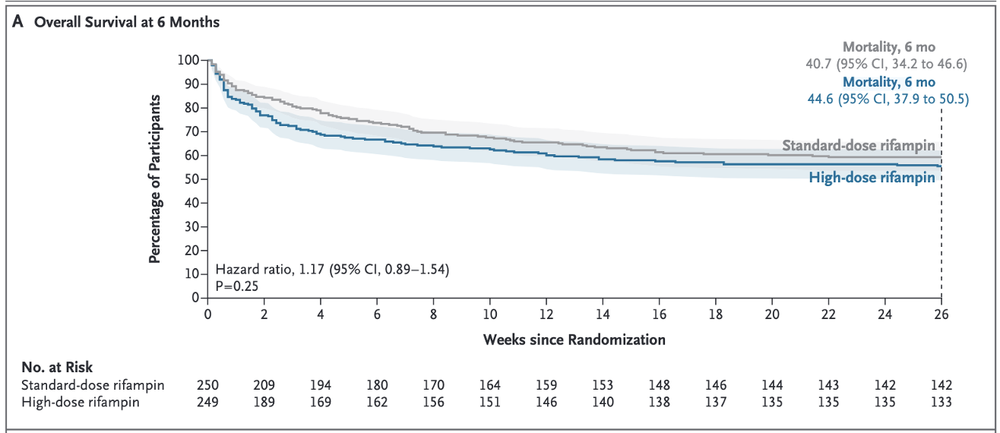
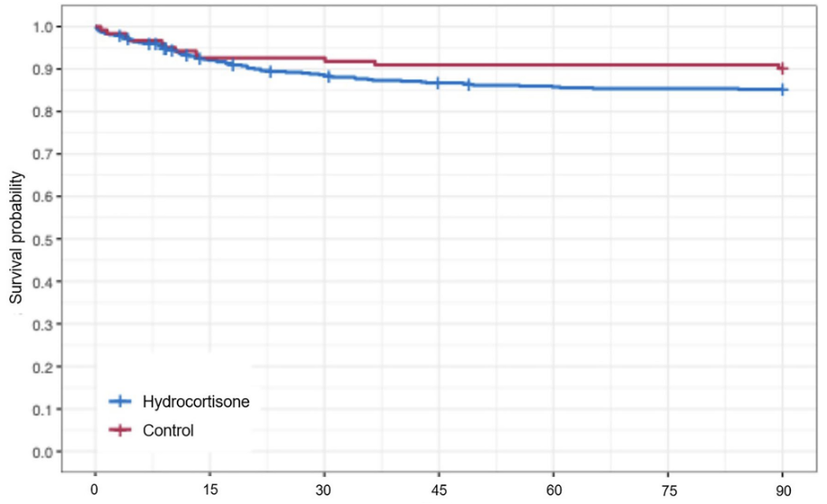
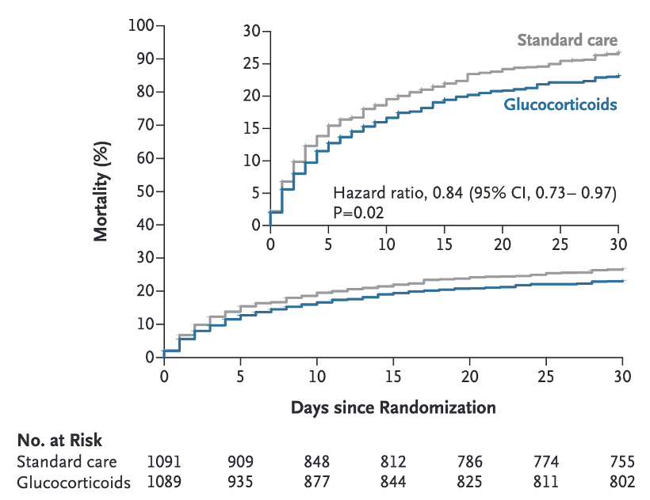

Along with my colleague [Hermaleigh Townsley](https://orcid.org/0000-0002-2517-722X) I made this run down of the top, practice changing papers of 2025. It was originally a presentation to our clinical ID department in Sheffield and I've stripped out the summaries for this post.

We have aimed to primarily include papers that we think are of clinical relevance.

It is heavily inspired by the wonderful summaries that [Josh Davis](https://aimed.net.au/2025/03/04/top-10-infectious-diseases-papers-2024-prof-josh-davis/) has been doing for several years (he was joined this year by Steve Tong, Emily McDonald and Bassem Ghanem).

## 1. Mosnodenvir for Dengue Prophylaxis

**Durbin AP et al. Daily Mosnodenvir as Dengue Prophylaxis in a Controlled Human Infection Model. *N Engl J Med.* 2025;393(21):2107–2118.** DOI: [10.1056/NEJMoa2500179](https://doi.org/10.1056/NEJMoa2500179)

**Why it matters:** Dengue threatens approximately half the world's population. No approved antiviral treatment or rapid prophylaxis currently exists, and vaccines require weeks to confer protection.

**Study design:** Phase 2a, double-blind, randomised, placebo-controlled human challenge trial. 30 healthy adults without prior dengue/Zika exposure were given oral mosnodenvir (low, medium, or high dose) for 5 days before and 21 days after subcutaneous inoculation with an attenuated DENV-3 strain.

**Key results:** 60% of participants in the high-dose group had no detectable DENV-3 RNA after challenge, compared to 0% in the placebo group. Fewer symptoms in the high-dose group wih similar adverse effect profiles across groups. Emerging RNA variations (potential resistance signals) were detected in all mosnodenvir recipients with detectable viral RNA, and in none of the placebo group, which is a significant note of caution.

{width="400"}

**Caveat:** Johnson & Johnson discontinued further development in 2024. The drug's future is currently in limbo, though licensing negotiations are reportedly ongoing.

## 2. Partner Treatment for Bacterial Vaginosis

**Vodstrcil LA et al. Male-Partner Treatment to Prevent Recurrence of Bacterial Vaginosis. *N Engl J Med.* 2025;392(10):947–957.** DOI: [10.1056/NEJMoa2405404](https://doi.org/10.1056/NEJMoa2405404)

**Why it matters:** Bacterial vaginosis (BV) is the most common vaginal condition in reproductive-age women worldwide, affecting around 1 in 3. Recurrence rates after standard treatment exceed 50% at 12 weeks. Epidemiological evidence has long suggested sexual transmission, but partner treatment trials had previously shown no benefit.

**Study design:** Open-label RCT (the StepUp trial). 164 heterosexual monogamous couples where the woman had symptomatic BV. Standard care (female treatment only, n=83) vs. standard care plus male partner treatment with oral metronidazole BD and 2% clindamycin penile cream for 7 days (n=81).

**Key results:** BV recurrence at 12 weeks: 35% in the intervention group vs. 63% in the control group - Trial stopped early at interim analysis due to demonstrated inferiority of standard care - Note: 14% of male partners took less than 70% of prescribed treatment.

**Impact:** This study provides the strongest evidence to date that BV-associated bacteria are sexually transmitted. ACOG has since updated guidance to recommend considering concurrent partner therapy for recurrent BV.

## 3. Continuation vs. Stopping Immunosuppression During Infection in Rheumatology Patients

**Opdam et al., Continuation Versus Temporary Interruption of Immunomodulatory Agents During Infections in Patients With Inflammatory Rheumatic Diseases: A Randomized Controlled Trial. *Clinical Infectious Diseases.*** 2026;82(3):420-426. DOI: [10.1093/cid/ciaf442](https://doi.org/10.1093/cid/ciaf442)

**Why it matters:** Whether to pause immunomodulatory agents (IAs) during an acute infection is a common and often agonising clinical decision for physicians managing rheumatic disease patients. IAs may have long half-lives, help control underlying disease, and — in some contexts — may even be beneficial in infection.

**Study design:** Pragmatic, open-label, Dutch multicentre RCT of 1,142 patients with inflammatory rheumatic disease. Patients were randomised to either continue or temporarily interrupt IAs at the point of developing an infection.

**Key results:** - Adjusted risk difference of 1.71% (95% CI: −1.99 to 5.39) in favour of continuation - No significant difference in duration of infectious symptoms or severity of rheumatological flare. The study was underpowered, but crucially identified **no evidence of harm** from continuation

**Bottom line:** Reassuring data that continuing immunosuppression through infection appears safe — though a larger definitive trial would be welcome.

## 4. Prophylactic Antibiotics for Variceal Bleeding in Cirrhosis (Bayesian Meta-analysis)

**Prosty et al.,** **Prophylactic Antibiotics for Upper Gastrointestinal Bleeding in Patients With CirrhosisA Systematic Review and Bayesian Meta-Analysis.** JAMA Internal Medicine 2025;185;(10):1194-1203. DOI: [10.1001/jamainternmed.2025.3832](https://doi.org/10.1001/jamainternmed.2025.3832)

**Why it matters:** Most guidelines recommend 5–7 days of IV antibiotic prophylaxis following upper GI bleeding in cirrhosis, based on older, small, single-centre trials with inconsistent outcome definitions. Third-generation cephalosporins are typically used, raising concerns about *C. difficile* risk.

**Study design:** Bayesian meta-analysis assessing all-cause mortality with a 5% non-inferiority margin, comparing short courses (0–3 days) versus longer antibiotic courses.

**Key results:** 97% probability of non-inferiority for short courses or no antibiotics in terms of all-cause mortality. Short courses were inferior for development of subsequent infection, though certainty was low due to poor study quality.

{width="600"}

**Clinical implication:** May support de-escalation of antibiotic duration after variceal bleeding in appropriately selected patients, reducing *C. difficile* risk.

## 5. Methenamine Hippurate for UTI Prevention in Older Women (ImpresU)

**Heltveit-Olsen SR et al. Methenamine hippurate as prophylaxis for recurrent urinary tract infections in older women — a triple-blind, randomised, placebo-controlled, phase IV trial (ImpresU). *Clin Microbiol Infect.* 2025.** DOI: [10.1016/j.cmi.2025.07.006](https://doi.org/10.1016/j.cmi.2025.07.006)

**Why it matters:** Although the ALTAR trial previously showed methenamine hippurate was non-inferior to prophylactic antibiotics in mixed-age women, there remained a need for evidence specifically in older women (≥70 years), who bear the highest UTI burden — and in a placebo-controlled design.

**Study design:** Triple-blinded RCT. Women ≥70 years with recurrent UTIs recruited from general practice across 4 European countries. 1g methenamine hippurate BD vs. placebo for 6 months, followed by 6 months drug-free follow-up.

**Key results:** 87 UTIs in the intervention group vs. 111 in the placebo group over 6 months. Fewer UTIs requiring antibiotic treatment while on methenamine: incidence rate ratio 0.75 (95% CI 0.57–1.0, p=0.049). Importantly, UTI rate increased once methenamine was stopped: IRR 1.7 (95% CI 1.3–2.3, p\<0.001) raising questions about rebound risk

## 6. Corticosteroids in Non-HIV PCP (PIC Trial)

**Lemiale V et al. Adjunctive corticosteroids in non-AIDS patients with severe *Pneumocystis jirovecii* pneumonia (PIC): a multicentre, double-blind, randomised controlled trial. *Lancet Respir Med.* 2025.** DOI: [10.1016/S2213-2600(25)00125-0](https://doi.org/10.1016/S2213-2600(25)00125-0)

**Why it matters:** PCP in HIV-negative immunocompromised patients carries a hospital mortality of 30–50%, significantly higher than in HIV-positive patients (10–20%). Corticosteroids are established practice in HIV-associated PCP, but evidence in non-HIV patients was lacking.

**Study design:** Multicentre, double-blind, RCT at 27 hospitals in France. HIV-negative immunocompromised adults with confirmed PCP and acute hypoxaemia, within 7 days of starting anti-*Pneumocystis* treatment. IV methylprednisolone 30mg tapering over 21 days vs. placebo.

**Key results:** Primary outcome 28-day mortality: HR 0.62 (95% CI 0.37–1.05), p=0.074 — **did not reach significance**. However, a [Bayesian re-analysis](https://doi.org/10.1016/j.cmicom.2025.105141) incorporating data from the HIV trials found \>99.9% probability of benefit, with an odds ratio of 0.51 (95% credible interval 0.32–0.77).

{width="500"}

**The nuance:** The frequentist primary analysis was negative, but the Bayesian lens is compelling. This is a classic case of an underpowered trial (due to the challenges in recruiting these patients) where the direction of effect and clinical logic is clear, even if the threshold for statistical significance wasn't met. Most clinicians are likely to continue using steroids in severe non-HIV PCP.

## 7. DOTS: Dalbavancin for *S. aureus* Bacteraemia

**Turner NA et al. Dalbavancin for Treatment of *Staphylococcus aureus* Bacteremia: The DOTS Randomized Clinical Trial. *JAMA.* 2025;334(10):866–877.** DOI: [10.1001/jama.2025.12543](https://doi.org/10.1001/jama.2025.12543)

**Why it matters:** Complicated SAB carries \~30% 1-year mortality and typically requires 4–8 weeks of IV antibiotics via a PICC line, with all the associated hazards: clots, catheter infections, restricted mobility, and the requirement for outpatient IV services. Dalbavancin, a long-acting lipoglycopeptide, requires only two doses (days 1 and 8) and no long-term IV access.

**Study design:** Open-label, assessor-masked, North American RCT (2021–2023). 200 patients with 'complicated' SAB (by the IDSA criteria) who had cleared their blood cultures after 72 hours–10 days of standard therapy, randomised 1:1 to dalbavancin (1500mg on days 1 and 8) or standard 4–8 week IV therapy.

**Exclusions:** CNS infection, left-sided endocarditis, planned right-sided valve surgery, unresected prosthetic material, polymicrobial infection, severe immunosuppression.

**Key results:** - Primary outcome (DOOR score at day 70): probability of a superior outcome with dalbavancin was **47.7%** (95% CI 39.8–55.7%) — **did not meet superiority** - Clinical efficacy at day 70: 73% dalbavancin vs. 72% standard (non-inferior) - Serious adverse events: 40% dalbavancin vs. 34% standard - Dalbavancin patients spent 1 fewer day in hospital on average

**Interpretation:** Not superior by DOOR, but met non-inferiority. The pragmatic benefit of avoiding a PICC line may be the real story here, particularly for patients with difficult vascular access or social circumstances that preclude home IV therapy.

## 8. CloCeBa: Cefazolin vs. Cloxacillin for MSSA Bacteraemia

**Burdet C et al. Cloxacillin versus cefazolin for meticillin-susceptible *Staphylococcus aureus* bacteraemia (CloCeBa): a prospective, open-label, multicentre, non-inferiority, randomised clinical trial. *Lancet.* 2025;406(10517):2349–2359.** DOI: [10.1016/S0140-6736(25)01624-1](https://doi.org/10.1016/S0140-6736(25)01624-1)

**Why it matters:** Anti-staphylococcal penicillins (ASPs) such as cloxacillin (we use a close analogue flucloxacillin in the UK) are traditionally first-line for MSSA bacteraemia, but North Americans have typically favored the first-generation cehaplosporin, cefazolin. The latter is suspected to have lower AKI rates, and possible superior clinical outcomes.

**Study design:** Open-label, non-inferiority RCT at 21 French hospitals. Adults with MSSA bacteraemia (excluding those with intravascular implants or suspected CNS infection) randomised 1:1 to cefazolin or cloxacillin IV for the first 7 days.

**Key results:** Cefazolin was **non-inferior** to cloxacillin using a 12% non-inferiority margin across composite outcomes of mortality, microbiological, and clinical endpoints. However, a signal toward possible inferiority was seen in patients with isolates carrying type A blaZ β-lactamase, warranting further attention. Significantly fewer adverse effects with cefazolin (mainly AKI).

**Implications:** This has been slightly surpassed by the [SNAP trial](https://www.snaptrial.com.au/) but it is reassuring to see pretty comparable results. Cefazolin can now be used as first-line for most MSSA bacteraemia, with the *blaZ* type caveat is an annoying side-note.

## 9. ALABAMA: Penicillin Allergy De-labelling in Primary Care

**Sandoe JAT et al. Penicillin allergy assessment pathway versus usual clinical care for primary care patients with a penicillin allergy record in the UK (ALABAMA): an open-label, multicentre, randomised controlled trial. *Lancet Prim Care.* 2025;1:100006.** DOI: [10.1016/S3050-5143(25)00006-8](https://doi.org/10.1016/S3050-5143(25)00006-8)

**Why it matters:** Around 90% of penicillin allergy labels in primary care are incorrect. These labels drive avoidable use of broader-spectrum antibiotics, potenitally worsening outcomes and contributing to antimicrobial resistance. And Beta-lactams are the besta-lactams.

**Study design:** Pragmatic, open-label RCT across 51 NHS general practices in England. Patients with a penicillin allergy record and a recent antibiotic prescription (excluding anaphylaxis or SCAR) were randomised to a structured allergy assessment pathway (PAAP) vs. usual care.

**Key results:** - N = 401 (PAAP) vs. 410 (usual care) - 91% of PAAP participants underwent testing → 92% overall negative - 64% proceeded directly to oral challenge (5.5% positive). 36% had skin testing first (2% positive on skin testing; 11% positive on subsequent oral challenge). **96% of those who tested negative successfully had the allergy removed from their records.** Primary outcome: significantly more penicillin prescriptions in the de-labelled group, with lower "treatment response failure" rate.

**Clinical significance:** This is the first RCT to confirm that penicillin allergy de-labelling could be initiated in primary care. However, complex trial infrastructure, oversight by an immunologist and the need to do the actual challenges in secondary care mean some logistical hurdles are yet to be overcome. The SystmOne-integrated pathway could support a broader implementation.

## 10: HARVEST — High-Dose Rifampicin for TB Meningitis

**Meya DB, Cresswell FV et al. Trial of High-Dose Oral Rifampin in Adults with Tuberculous Meningitis. *N Engl J Med.* 2025;393(24):2434–2446.** DOI: [10.1056/NEJMoa2502866](https://doi.org/10.1056/NEJMoa2502866)

**Why it matters:** TB meningitis carries mortality and disability rates above 50%, even with standard treatment. The standard rifampicin dose (\~10mg/kg) achieves poor CNS penetration. High-dose rifampicin improves penetration and has shown survival signals in early phase trials.

**Study design:** Phase III, double-blind, randomised, placebo-controlled trial in Uganda, South Africa, and Indonesia. Patients with possible/probable/confirmed TB meningitis (HIV+ or −) randomised to standard treatment with standard dose rifampicin vs. 35mg/kg oral rifampicin for the induction phase.

**Key results:** There were numerically (but not statistically significantly) worse outcomes in the high dose group. Those with HIV on ART and those with \<5 cells/μl did worse.

**Summary:** This is a disappointing result from a well conducted trial.

## 11: REMAP-CAP — Steroids in Severe CAP

**REMAP-CAP Investigators, Angus DC. Effect of hydrocortisone on mortality in patients with severe community-acquired pneumonia: The REMAP-CAP Corticosteroid Domain Randomized Clinical Trial. *Intensive Care Med.* 2025;51(4):665–680.** DOI: [10.1007/s00134-025-07861-w](https://doi.org/10.1007/s00134-025-07861-w)

**Why it matters:** Following the CAPE-COD trial (which showed hydrocortisone significantly reduced 28-day mortality in severe CAP), guidelines were updated to recommend steroids in ICU CAP. REMAP-CAP followed this and found something troubling.

**Study design:** Large adaptive platform trial using Bayesian adaptive randomisation. ICU adults with CAP (±shock, ±influenza) randomised to 50mg QDS hydrocortisone for 7 days vs. control. Primary endpoint: 90-day mortality.

**Key results:** 90-day mortality: **9.8% (control) vs. 15% (hydrocortisone)** — the wrong direction.

Pre-specified stopping rule for futility triggered: \<5% chance of \>20% benefit. Probabilities of superiority (OR \< 1) ranged from 9–16% across shock/flu subgroups, far below conventional thresholds

{width="600"}

**Interpretation:** These findings are in direct conflict with CAPE-COD and a 2025 meta-analysis (Smit et al., benefit in those with CRP \>204 mg/L). The discrepancy is the subject of active debate, with an important note that the REMAP-CAP adaptive design and errors in randomisation process early on resulted in highly unequal group sizes (536 hydrocortisone vs. 122 control). The steroid-in-CAP story is very much unresolved and another arm of this trial (adaptive steroids in response to shock) remains under recruitment.

## 11.5: SONIA — Steroids in Pneumonia in Kenya

**Lucinde RK et al. A Pragmatic Trial of Glucocorticoids for Community-Acquired Pneumonia. *N Engl J Med.* 2025;393(22):2187–2197.** DOI: [10.1056/NEJMoa2507100](https://doi.org/10.1056/NEJMoa2507100)

**Why it matters:** Mortality from CAP in sub-Saharan Africa is up to 5 times higher than in high-income settings. The evidence base for steroids in CAP had been generated almost entirely in well-resourced ICUs. SONIA specifically asked whether a cheap, oral steroid course could help in a general ward, low-resource setting.

**Study design:** Pragmatic, open-label, RCT across 18 Kenyan public hospitals. 2,180 adults with clinical CAP randomised to 10 days of low-dose oral glucocorticoids (dexamethasone, hydrocortisone, methylprednisolone, or prednisolone) vs. standard care.

**Key results:** - 30-day mortality: 22.6% (steroids) vs. 26% (standard care) — HR 0.84 (95% CI 0.73–0.97, p=0.02) - 211/1,089 patients had an adverse event; 30% felt to be related to treatment (34 tuberculosis cases, 35 hyperglycaemia events). A nice counterweight to REMAP-CAP: steroids appear beneficial here, although the context is radically different.

## Keep an Eye Out For: Dabigatran for *S. aureus* Bacteraemia?

DOI: [10.1136/bmjopen-2025-107493](https://doi.org/10.1136/bmjopen-2025-107493)

An emerging area of interest – whether anticoagulation with dabigatran may have an adjunctive role in the management of *Staphylococcus aureus* bacteraemia (SAB), given the role of fibrin in biofilm formation and vegetation development.

This presents a trial protocol for what seems like a mad idea, but seemingly one with solid preliminary data.
