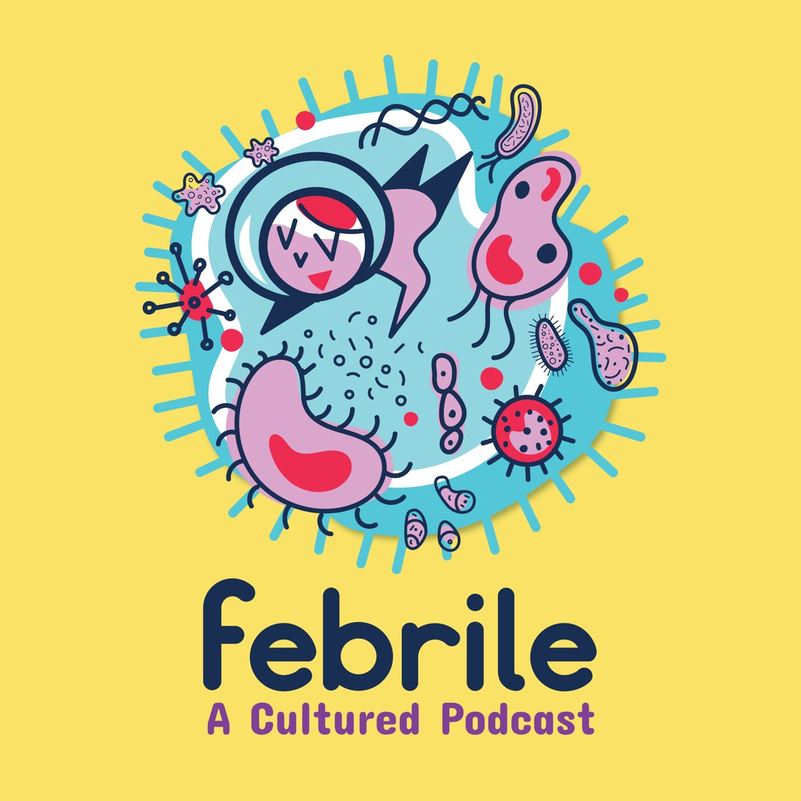
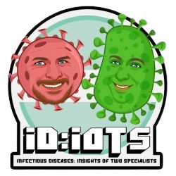
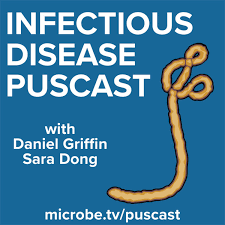
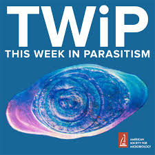
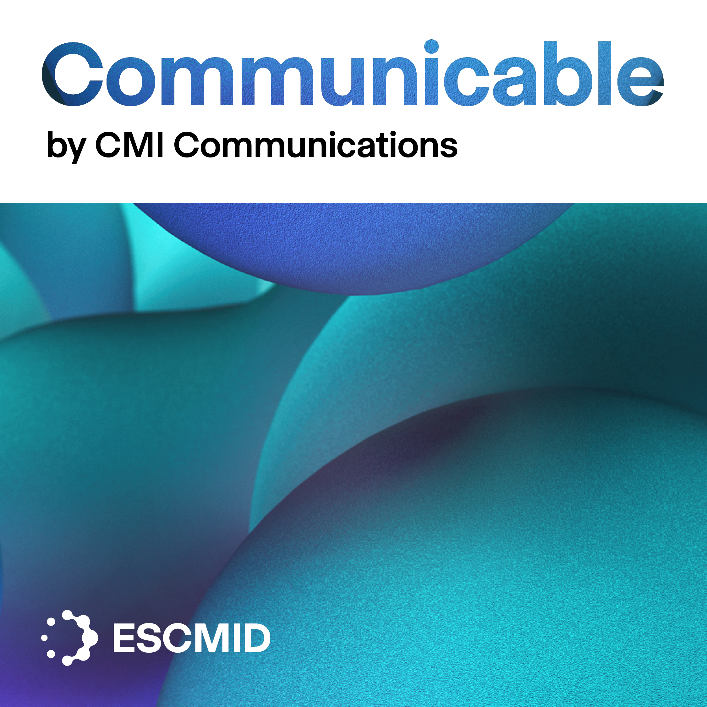
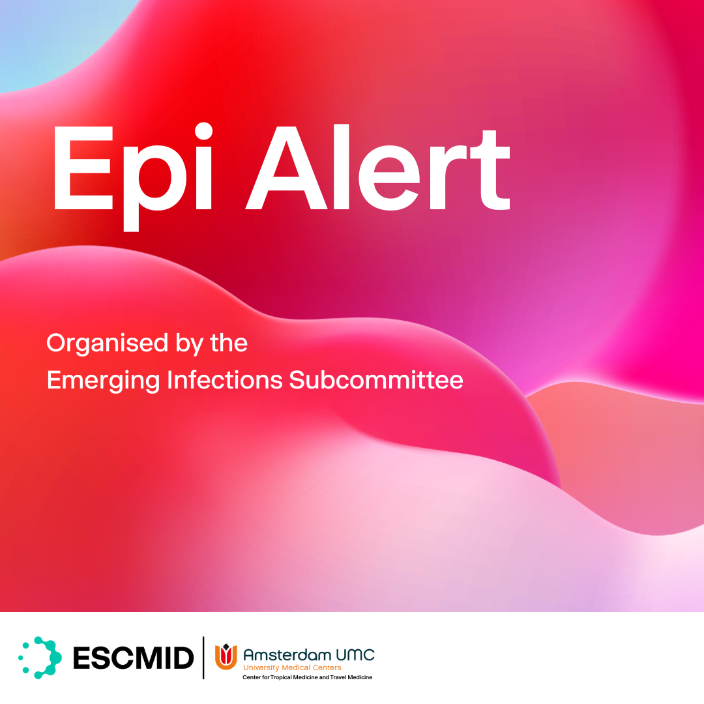

## Podcasts

### [Febrile](https://febrilepodcast.com/)

::: {.grid}
::: {.g-col-2}
{width=150}
:::
::: {.g-col-10}
An amazing, diverse podcast hosted by Sara Dong, an American ID attending. Topics range between clinical ID, epidemiology and management. The website has summaries and infographics from the episodes.
:::
:::

### [ID:IOTS](https://www.britishinfection.org/education-events/idiots-podcast)

::: {.grid}
::: {.g-col-2}
{width=150}
:::
::: {.g-col-10}
A UK based infection podcast.  Hosted by Jame and Callum, this was initially a microbiology flavoured podcast, aimed at UK based infection trainees sitting their speciality exams.  With time the remit has broaden and is relevant to anyone working in clinical infection medicine.
:::
:::

### [Puscast](https://www.microbe.tv/puscast/)

::: {.grid}
::: {.g-col-2}
{width=150}
:::
::: {.g-col-10}
This is a fortnightly rundown of recently released infectious diseases literature.  This is the second incarnation of this podcast.  The original was made by the inimitable [Mark Crislip](https://edgydoc.com/puscast-20182021) and was revived by the prolific Sara Dong and Daniel Griffin.  The original version of this is one of the reasons I chose infection medicine, and although this reboot lacks some of the acerbic wit of Mark Crislip it is just as informative. 
:::
:::

### [TWiP: this week in parasitism](https://www.microbe.tv/twip/)

::: {.grid}
::: {.g-col-2}
{width=150}
:::
::: {.g-col-10}
Second entry from Daniel Griffin, along with Vincent Racaniello and Christina Naula.  This podcast takes the form of a clinical case, followed by (possibly too many) responses from readers and a clinical discussion.  
There are also versions of this for microbiology and virology with a different set of hosts and slightly different formats. 
:::
:::

### [Communicable](https://www.escmid.org/guidelines-journals/escmid-journals/communicable-podcast/)

::: {.grid}
::: {.g-col-2}
{width=150}
:::
::: {.g-col-10}
A podcast from the editorial team at CMI communications. They cover a wide range of clinical infection topics, beyond simply promoting article in their journal.
:::
:::

## Alerts

### [ESCMID Epi Alerts](https://www.escmid.org/science-research/emerging-infections-subcommittee/eis-activities/)

::: {.grid}
::: {.g-col-2}
{width=150}
:::
::: {.g-col-10}
A succint weekly summary of global emerging infections and outbreaks from the new-ish Emerging Infections Subcomittee from ESCMID. 
:::
:::